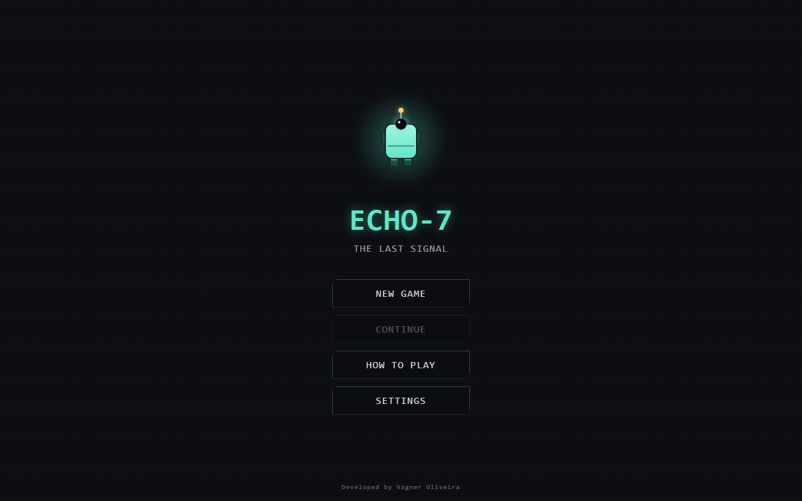
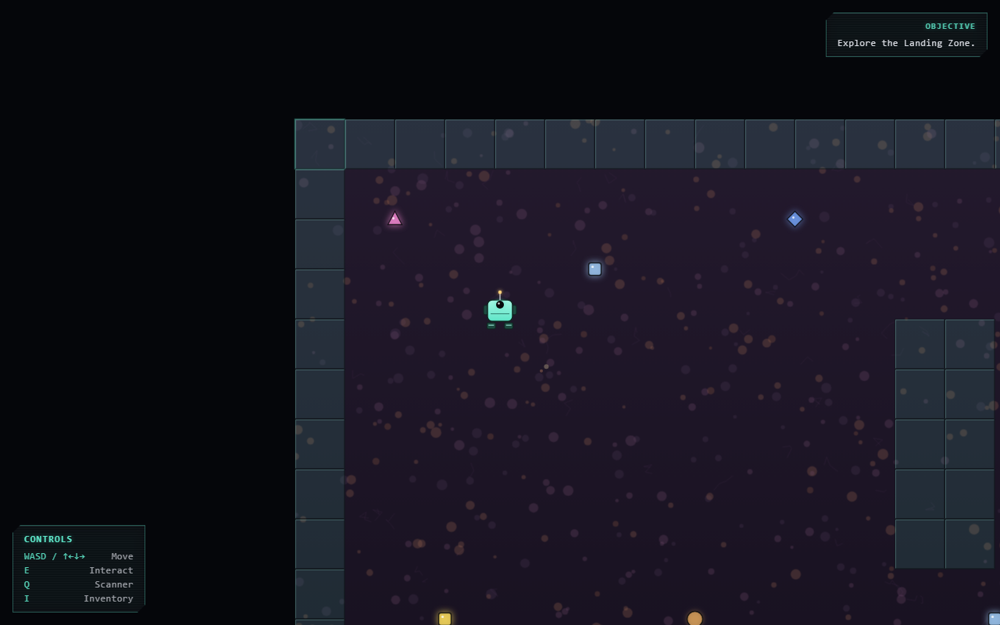
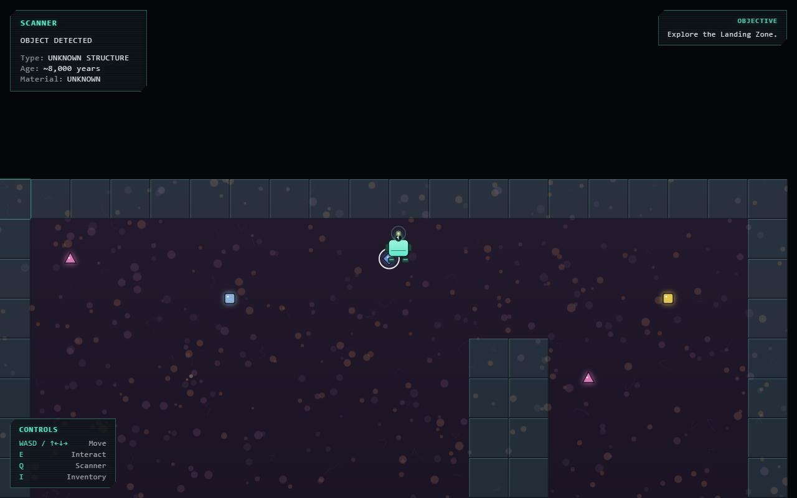
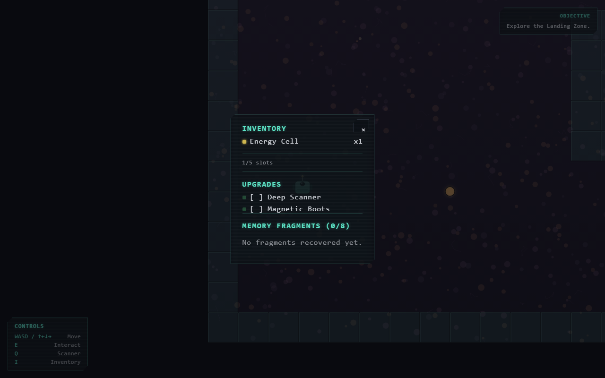
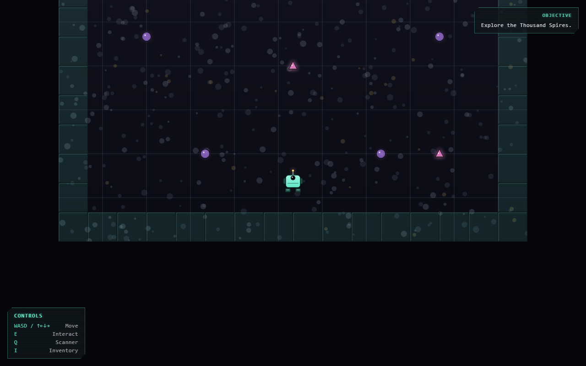
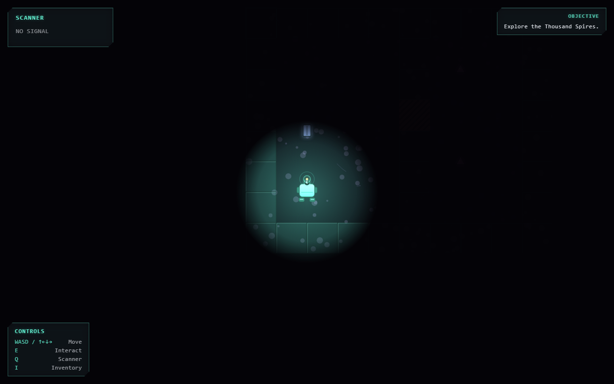
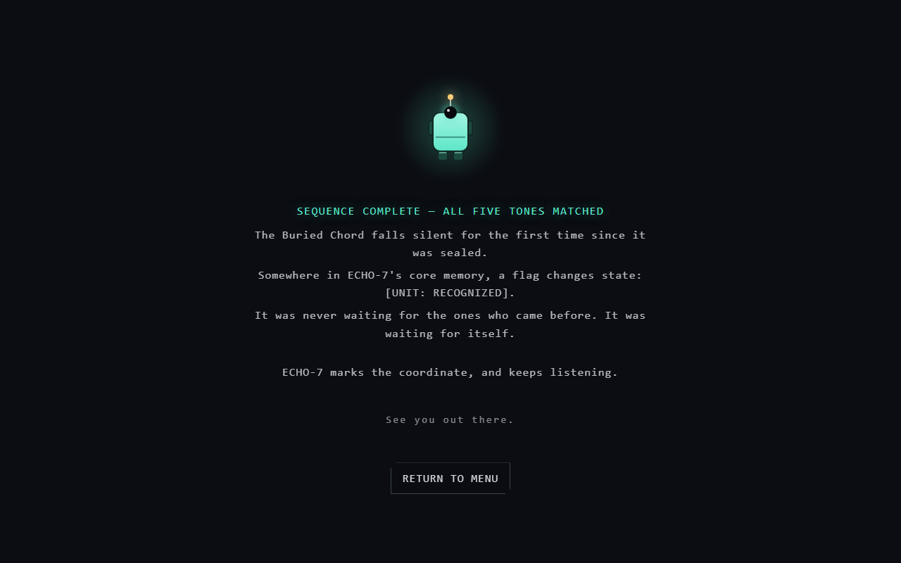

# ECHO-7 — The Last Signal

Jogo de exploração sci-fi para navegador, sem combate e sem diálogo. Você controla o ECHO-7, um robô explorador enviado sozinho a um planeta que se acreditava abandonado, para investigar uma transmissão que não deveria existir. A história não é contada, é reconstruída: escaneando estruturas antigas, recuperando fragmentos de memória corrompidos e decifrando o que aconteceu com uma expedição humana anterior que desapareceu sem deixar rastro. Upgrades abrem caminhos que antes eram impossíveis (o Deep Scanner revela o que estava escondido; as Magnetic Boots atravessam terreno hostil), puzzles guardam o que foi selado de propósito, e cada descoberta aproxima o ECHO-7 de uma resposta que ele não esperava encontrar.

## 🎮 Play

**[vagnerso.github.io/echo-7](https://vagnerso.github.io/echo-7/)**

Roda direto no navegador, sem instalação. Suporta teclado e telas de toque (celular/tablet — D-pad e botões aparecem automaticamente). Disponível em **Inglês** (padrão) e **Português do Brasil**, com cor do robô customizável — ambos em Settings, no menu principal.

**Controles:** `WASD`/setas para mover · `E` interagir · `Q` scanner · `I` inventário/upgrades/fragmentos. Também exibidos na tela durante o jogo (e como D-pad/botões em dispositivos touch).

## 📸 Screenshots

| Menu | Exploração |
|---|---|
|  |  |

| Scanner | Inventário |
|---|---|
|  |  |

| Thousand Spires (epílogo) | The Buried Chord (escuridão + pulso do radar) |
|---|---|
|  |  |

| Conclusão do epílogo |
|---|
|  |

## 🧠 AI-Assisted Development

Este projeto é usado deliberadamente como demonstração de **engenharia assistida por IA**, não como "vibe coding": design e arquitetura foram definidos e aprovados antes de qualquer código (Fase 0), o desenvolvimento avançou em fases pequenas e testáveis (dez para o MVP, mais outras depois do release), e toda decisão técnica não óbvia foi documentada com o porquê — inclusive os bugs reais encontrados e corrigidos ao longo do caminho.

- [`docs/AI_DEVELOPMENT.md`](docs/AI_DEVELOPMENT.md) — a metodologia usada, com uma tabela de exemplos reais de onde a IA entrou (brainstorming, arquitetura, implementação, debugging, testes, refactoring, conteúdo, documentação).
- [`docs/DECISIONS.md`](docs/DECISIONS.md) — registro de toda decisão técnica não óbvia, fase a fase, com contexto, alternativas consideradas e motivo.
- [`docs/ARCHITECTURE.md`](docs/ARCHITECTURE.md) — visão geral da arquitetura implementada.
- [`PROMPT MESTRE — ECHO-7_ O EXPLORADOR.md`](<PROMPT MESTRE — ECHO-7_ O EXPLORADOR.md>) — a especificação original do jogo (visão, mecânicas, narrativa, restrições) que guiou todo o desenvolvimento.

## 🏗️ Architecture

```
React (App.tsx)
   |
UI / HUD / Menus / Overlays        (components/)
   |
Game State                          (state/ - Zustand)
   |
Game Engine                         (engine/ - loop, input, câmera, partículas, áudio)
   |
Game Systems                        (systems/ - movimento, colisão, interação, scanner, puzzle, upgrades)
   |
World / Entities / Content          (world/, entities/, content/)
```

Nenhuma dessas camadas abaixo de `components/` importa React — é isso que torna a lógica de jogo testável sem DOM. Detalhes completos em [`docs/ARCHITECTURE.md`](docs/ARCHITECTURE.md).

## 🛠️ Tech Stack

- React + TypeScript (`strict` mode)
- Vite
- Canvas 2D (renderização da engine, fora do ciclo de render do React)
- Zustand (estado discreto de UI/jogo — não dados de alta frequência como posição)
- CSS Modules
- Vitest
- oxlint + Prettier
- Web Audio API (áudio sintetizado por código, sem arquivos de som)

## 🚀 Getting Started

Requer Node.js 22+.

```bash
npm install
npm run dev        # inicia o servidor de desenvolvimento
npm run build      # build de produção (type-check + bundle)
npm run test       # roda os testes (Vitest)
npm run lint       # roda o lint (oxlint)
npm run format     # formata o código (Prettier)
```

## 🧪 Testing

Testes ficam ao lado do código testado (`arquivo.ts` + `arquivo.test.ts`), priorizando lógica de jogo pura (`engine/`, `systems/`, `state/`, `save/`) — 123 testes automatizados no total. Ver critérios de teste em [`docs/DECISIONS.md`](docs/DECISIONS.md).

## 📁 Project Structure

```
src/
  components/    # UI React (HUD, menus, overlays, painéis)
  engine/        # game loop, input, câmera, canvas, partículas, áudio - sem React
  systems/       # lógica de gameplay pura (movimento, colisão, interação, scanner, puzzle, upgrades)
  entities/      # tipos das principais entidades (Player, Discovery, InventoryItem, Puzzle, Upgrade, MemoryFragment)
  world/         # modelo de região/tile/objeto e carregamento de mundo
  content/       # dados estáticos do jogo (regiões, puzzles, upgrades, fragmentos, cores do robô) - só identidade, sem texto
  i18n/          # dicionário de tradução (Inglês/Português-BR)
  state/         # stores Zustand (gameStore, uiStore, settingsStore)
  save/          # persistência em localStorage, versionada (progresso e preferências, separados)
  styles/        # CSS compartilhado entre componentes de UI
  hooks/         # ponte entre React e a engine/i18n
```

Ver [`docs/ARCHITECTURE.md`](docs/ARCHITECTURE.md) para o propósito de cada pasta em detalhe.

## 🗺️ Roadmap

**MVP (vertical slice):**

- [x] Fase 0 — Planejamento (GDD, arquitetura, decisões técnicas)
- [x] Fase 1 — Bootstrap (setup, canvas responsivo, game loop, tela inicial)
- [x] Fase 2 — Robot (ECHO-7, movimento, câmera, colisão)
- [x] Fase 3 — World (mapa, tiles, interação)
- [x] Fase 4 — Scanner
- [x] Fase 5 — Inventory
- [x] Fase 6 — Upgrades
- [x] Fase 7 — Puzzles (sistema de sequência + Região 2/Ancient Ruins)
- [x] Fase 8 — Narrative (Memory Fragments, missão, Região 3/Signal Core, Puzzle #2, final da vertical slice)
- [x] Fase 9 — Polish (partículas, transição de tela, áudio sintetizado)
- [x] Fase 10 — Release (GitHub Pages, save/load, documentação final)

**Pós-release:**

- [x] Polish visual — robô com chassi/pernas/antena animados, terreno procedural por região, UI com estilo compartilhado (glow, cantos técnicos, scanline), painel de comandos na tela
- [x] Internacionalização — Inglês (padrão) e Português do Brasil, dicionário customizado tipado, tela de Settings
- [x] Customização — cor do robô (5 opções), preferências persistidas separadas do progresso de jogo

**v2.0:**

- [x] Fase A — Controles mobile (suporte a telas de toque)
- [x] Fase B — Tutorial ("HOW TO PLAY" no menu principal)
- [x] Fase C — Região opcional 4 ("Buried Cache")
- [x] Tela inicial — retrato vetorial do ECHO-7 (reaproveitando a paleta de cor do robô), créditos do desenvolvedor no rodapé

**v2.1:**

- [x] Polish visual de mapas e itens — glow/contorno/brilho especular consistente em todo objeto do mundo (porta, coletável, switch, fragmento, scannable), faixas de risco nos tiles de hazard, ícone de cadeado nos tiles selados, bisel nas paredes, cor por tipo de item compartilhada entre o mundo e o inventário
- [x] Correção: entrada secreta da Buried Cache não vazava mais um marcador visível no mapa antes do Deep Scanner instalado
- [x] Anatomia do robô — pés com contorno e friso de esteira, braços laterais com balanço em contrafase ao caminhar, sinal de radar (anéis na antena) quando o scanner está ativo
- [x] Correção mobile: câmera renderizava o mundo em 1/`devicePixelRatio` do tamanho devido em telas de alta densidade (celular), fazendo tudo parecer mais "longe" que no desktop
- [x] Correção mobile: toque longo num botão do D-pad podia selecionar texto de outro painel da tela (seleção de texto desabilitada globalmente - o jogo não tem nenhum campo de texto)

**v3.0 — Thousand Spires:**

- [x] Epílogo pós-final: a tela de final ganhou a opção "continue exploring", levando a uma 5ª região nova (não é preciso recomeçar o jogo para ver)
- [x] Thousand Spires (`region-5`) — campo de torres de transmissão antigas; o puzzle de sequência de sempre ganhou 5 nós, cada um tocando uma nota (escala pentatônica) — resolver na ordem certa compõe a frase completa
- [x] 4 fragmentos de memória novos, amarrando o fio solto do Kade (Buried Cache, v2.0) ao gancho do final: transmissões da própria rede alienígena e registros restritos da unidade ECHO-7 sobre si mesma
- [x] The Buried Chord (`region-6`) — área secreta dentro de Thousand Spires (exige o Deep Scanner), em escuridão quase total: o pulso do radar da antena (v2.1, antes só cosmético) ganhou função real, revelando um raio ao redor do robô por alguns segundos a cada scan. Labirinto com duas passagens (tiles de hazard, em linhas diferentes) exigindo as Magnetic Boots, terminando numa câmara com um puzzle próprio de 4 nós — resolvido quase às cegas, só com os pulsos de luz — que libera os 2 fragmentos finais
- [x] Tela de conclusão do epílogo — coletar os dois fragmentos finais de The Buried Chord fecha o arco com uma tela própria (com o retrato do ECHO-7 e um tom de despedida), independente do final original do MVP

A vertical slice do MVP está completa (Landing Zone → Ancient Ruins → Signal Core), e o gancho do final agora tem uma continuação jogável inteira (Thousand Spires + The Buried Chord), com fechamento próprio, fechando o fio do Kade. Próximos passos possíveis: mais idiomas, sprites/arte de verdade (hoje 100% vetorial), ou um novo gancho a partir daqui.

> Este roadmap é o registro histórico de fases já concluídas. Toda nova funcionalidade deve ser adicionada aqui como um novo item (ou uma nova seção de versão) assim que for concluída — ver regra correspondente no `CLAUDE.md`.
